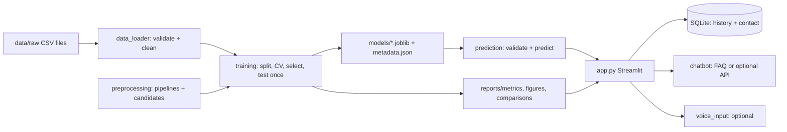

# Architecture (implemented components only)

```mermaid
flowchart LR
  RAW[data/raw CSV files] --> DL[data_loader: validate + clean]
  DL --> TR[training: split, CV, select, test once]
  PRE[preprocessing: pipelines + candidates] --> TR
  TR --> M[models/*.joblib + metadata.json]
  TR --> R[reports/metrics, figures, comparisons]
  M --> PRED[prediction: validate + predict]
  PRED --> APP[app.py Streamlit]
  R --> APP
  APP --> DB[(SQLite: history + contact)]
  APP --> BOT[chatbot: FAQ or optional API]
  APP --> VOICE[voice_input: optional]
```
The app never retrains; it loads saved models (cached) and saved reports.
